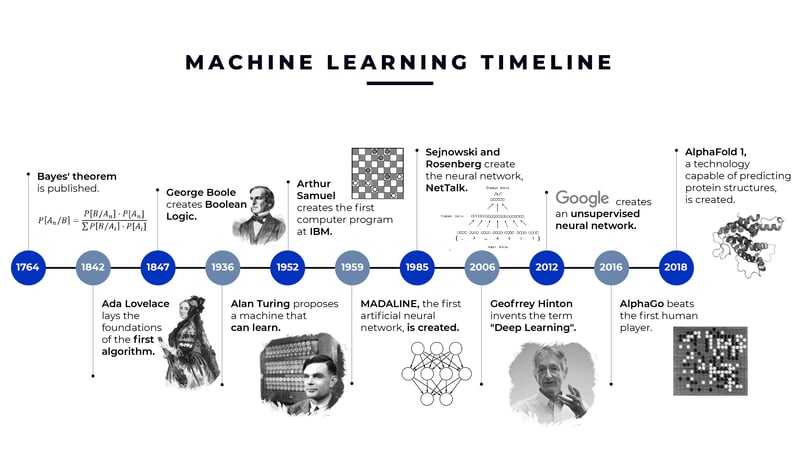

# Course Overview

The syllabus (available on blackboard) is the most authoritative and up-to-date place for information about the schedule and / or policies.  You are responsible for reviewing it on a regular basis!  The instructor will strive to notify you of any updates.

## Class Flow

* This is a \(mostly\) flipped class – you are expected to review Jupyter Notebooks and Readings for the week  _before _ class
* Class time will be devoted to answering your questions and working through exercises
  * Most work will be done in pairs
* Most classes will have a quick quiz at the beginning of class to check your understanding of that week’s materials
  * Quizzes will be drawn directly from readings and provided materials
  * Quizzes account for 20% of your grade

## Assignments (IST707)

* **10 assignments \(30 points total\)**
  * 2 warm\-up assignments \(1 point each\) : Covering background necessary for this class
  * 8 regular assignments \(3\.5 points each\) : Various exercises applying techniques covered; one assignment is peer feedback
* **Group Project \(50 points total\):**
  * Teams of 3\-5
  * No individual projects\!

## Assignment / Report Format

* Include one or both of:
  * A Jupyter notebook with code
  * A Markdown file for accompanying narrative text
* __NO WORD DOCUMENTS OR PDFs__
* __Notebook Format__
  * Rubrics will be provided for each notebook indicating required sections
  * Notebooks should only include:
    * Well documented\, runnable code and results
    * Markdown sections explaining each section of code
  * 2 – 5 pages\, professionally written
* __Markdown format__
  * No spelling or grammar errors\, any equations properly formatted; see [GitHub’s Markdown guide](https://docs.github.com/en/get-started/writing-on-github/getting-started-with-writing-and-formatting-on-github/quickstart-for-writing-on-github)
* ***Assignments not following these formatting guidelines will be returned without grading***

## Group Project

* End\-to\-end ML Project: Pick your own data and problem\.  Use any techniques you want\.  Produce a final \(10\-12\) page report\.
* Milestones:
  * __Project Checkpoint 1 \(10 points\):__ Proposal
  * __Project Checkpoint 2 \(10 points\):__ Data description and analysis plan
  * __Project Checkpoint 3 \(10 points\)__ : Presentation
  * __Project Final Turn\-in \(15 points; end of exam period\)__
* __Peer assessment__ is part of the grade \(5 points\)

## Grading Summary

| Assessment Item |  | Weight % |
| :-: | :-: | :-: |
| Homework assignments |  | 30 |
| Quizzes |  | 20 |
| Project | Checkpoint 1 | 10 |
|  | Checkpoint 2 | 10 |
|  | Checkpoint 3 | 10 |
|  | Report | 15 |
|  | Peer assessment | 5 |
| Total |  | 100 |

## Policies

* __Quizzes__
  * Cannot be made up
  * Exceptions granted for extenuating circumstances
  * Quizzes will not be accepted more than a week late\.
* __Assignments__
  * Due midnight before the next class\.
  * Week\-long grace period for all  _regular_  assignments
  * Assignments not meeting formatting requirement returned without grading\.
  * Assignments more than a week late lose 15% and may not be graded till the end of the semester
* __Group project__
  * Late checkpoint submissions will lose 50%
  * All team members present for checkpoint 3

* __Plagiarism__
  * Individual assignments that are substantially the same or copy from other sources will be given a 0\.
  * Two violations of this policy will be reported to the university
  * You may ask for help from other students; please acknowledge their assistance
* __ChatGPT / other AI tools__
  * ChatGPT is a fancy search engine
  * Use of ChatGPT is encouraged\, as long as it is acknowledged
  * Do  __not__  submit raw ChatGPT answers / writing
    * It makes mistakes
    * It cannot think
    * It is not my student
  * See syllabus for detailed policy

## Tools / Textbook

* Text: [Hands\-on Machine Learning with Scikit\-Learn\, Keras\, and TensorFlow](https://www.amazon.com/Hands-Machine-Learning-Scikit-Learn-TensorFlow-dp-1098125975/dp/1098125975/ref=dp_ob_title_bk) – 3rd Edition
* Discord for course communication
* Blackboard for resources
* GitHub for all assignments
* Jupyter notebooks and Codespaces / Google CoLab \(or alternatives\) for all code
  * All code in Python
* Markdown for all written reports

# CITRA Research Extra Credit

* This course participates in the Communication\, Information\, and Technology Research Alliance \(CITRA\) Research Pool
* You can apply up to 4 CITRA credits to receive extra credit in this course
  * Each CITRA credit roughly corresponds to 30 min of work
  * Each CITRA credit is worth \.5% on your final grade
* See the syllabus for additional detail

## Schedule (IST707)

| Date | Class | Readings | Assignments |
| :-: | :-: | :-: | :-: |
| Week1: 1/16 | Introduction to Course & ML Ecosystem Review | Chapter 1 | Warm-up Assignment #2 |
| Week2: 1/23 | ML Workflow **QUIZ: Readings (Ch. 1 & 2) and Preliminaries**  | Chapter 2  | HW1: End-to-end ML |
| Week3: 1/30 | Data Preparation & Evaluation **QUIZ: Readings**  | Chapter 3 | HW2: Imputation & Evaluation |
| Week4: 2/6 | Classifiers1: Logistic regression, KNN, SVM, NB **QUIZ: Readings** | Chapter 4 & 5 | HW3: Classification Challenge  |
| Week5: 2/13 | Classifiers2: Decision Trees, Ensemble Methods **QUIZ: Readings**  | Chapter 6 & 7 | HW4: Data Challenge: Breaking Classifiers |
| Week6: 2/20 | Hyperparameter Tuning; ML in the real world; In-class exercise | Heilmeier Catechism; Appendix A | Project Checkpoint 1 – Data and plan |
| Week7: 2/27 | Project Checkpoint 1 Presentations / Workshop |   | HW5: Project Peer Feedback |
| Week8: 3/5 | Dimensionality Reduction **QUIZ: Readings** | Chapter 8 | Project Checkpoint 2: Data Description and Analysis Plan (3 weeks) |
| **Spring Break! 3/11** | | **Please review materials in Week 9**   |  |
| Week9: 3/18 | Clustering smorgasbord! | Chapter 9 | HW6: Clustering categorical data |
| Week10: 3/25 | Introduction to deep learning **QUIZ: Readings** | Chapter 10 |   |
| Week11: 4/1 | Functional API; TensorFlow tools; Activation functions  **QUIZ: Readings** | Chapter 11 | HW7:  Deep Learning practice |
| Week12: 4/8 | Learning Schedules; Optimizers **QUIZ: Learning Schedules** |   | HW8:  CNN-based Image Recognition |
| Week13: 4/15 | Regularization, Hyperparameter tuning |  |  |
| Week14: 4/22 | Project Presentations (Checkpoint 3) |  |  |
| **5/7** |  |  **Final Project Report Due** |

# Introduction to ML

## What is Machine Learning?

* __Tom M\. Mitchell \(1997\)__ :
  * "A computer program is said to learn from experience  _E_  with respect to some class of tasks  _T_  and performance measure  _P_ \, if its performance at tasks in  _T_ \, as measured by  _P_ \, improves with experience  _E_ \."
  * Source:  _Machine Learning_ \, Tom M\. Mitchell\, McGraw Hill\, 1997\.
* __Arthur Samuel \(1959\)__ :
  * "Machine Learning is the subfield of computer science that gives computers the ability to learn without being explicitly programmed\."
  * Arthur Samuel is credited with coining the term "Machine Learning" in 1959\. He's known for his work on the Samuel Checkers\-playing Program\.
* __Kevin P\. Murphy \(2012\)__ :
  * "Machine learning is a set of methods that can automatically detect patterns in data\, and then use the uncovered patterns to predict future data\, or to perform other kinds of decision\-making under uncertainty \(such as planning how to collect more data\)\."
  * Source:  _Machine Learning: A Probabilistic Perspective_ \, Kevin P\. Murphy\, MIT Press\, 2012\.
* __Aurélien Géron \(2015\)__ :
  * "Machine Learning is the science \(and art\) of programming computers so they can learn from data\.”
  * Source: Hands\-on Machine Learning \(your text\-book\!\)

## ML Origins

* __Early Theoretical Foundations__ :
  * “Reason\.\.\. is nothing but Reckoning \(that is\, Adding and Subtracting\) of the Consequences of general names agreed upon for the marking and signifying of our thoughts\.\.\.” –  _Thomas Hobbs\, Leviathon \(1651\)_
* __Turing Test \(1950\)__ :
  * A "universal machine" that could simulate the behavior of any other machine
  * The "Turing Test" as a measure of a machine's ability to exhibit intelligent behavior indistinguishable from that of a human\.
* __Advent of Electronic Computers \(1940s\-1950s\)__ :
  * The creation of electronic computers provided the necessary tools for exploring computational approaches to problem\-solving\.
* __Birth of Artificial Intelligence \(1956\)__ :
  * At the Dartmouth Workshop in 1956\, the term "Artificial Intelligence" \(AI\) was coined\. This event is often considered the birth of AI as a formal academic discipline\. Early AI research focused on problem\-solving\, logical reasoning\, and symbolic methods\.

# Applications of Machine Learning

* __Healthcare & Life Sciences__
  * Disease Identification & Diagnostics\,  Drug Discovery & Personalized Medicine\, Predictive Analytics
* __Finance & Banking__
  * Fraud Detection\,  Algorithmic Trading\,  Credit Scoring
* __E\-Commerce & Retail__
  * Recommendation Systems\, Demand Forecasting\, Customer Sentiment Analysis
* __Automotive & Transportation__
  * Autonomous Vehicles\,  Predictive Maintenance\, Traffic Prediction
* __Energy & Utilities__
  * Smart Grid Management\, Predictive Maintenance for Equipment\, Energy Consumption Forecasting
* __Entertainment & Media__
  * Content Recommendation\, Sentiment Analysis\, Automated Content Creation

# ACTIVITY: Brainstorming applications (10 min)

# The Importance of Communication

* __Translating Technicalities__ :
  * ML involves intricate algorithms\, complex mathematical models\, and vast amounts of data\.
  * Stakeholders are often more interested in the  _actionable insights\._
  * ML practitioners must articulate findings in a comprehensible and meaningful manner\.
* __Understanding Stakeholder Needs__
  * Essential to understand the problem from a stakeholder's perspective\. Aims? Constraints?
  * Solutions must meet the needs of those who will use or be affected by the model\.
* __Setting Clear Expectations__ :
  * Overhype leads to disappointment and mistrust\.
  * Misuse can cause substantive harm
  * Vital to communicate what a model can and cannot do\, its limitations\, and any uncertainties involved\.
* __Ethical Considerations__ :
  * Increasing concerns about ML’s ethical implications\, potential biases\, and fairness\.
  * Transparent communication about how models work and their potential pitfalls is crucial\.

# Failures of Communication

* __Google Flu Trends__  : 
  * Google’s attempt to predict flu outbreaks using search query data\.
  * High expectations and inconsistent performance led to skepticism about the utility of big data
  * Effort terminated\.
* __IBM Watson for Oncology__  :
  * Promised to revolutionize cancer treatment by providing personalized treatment recommendations
  * Erroneous treatment recommendations & over\-promotion of Watson's capabilities without clear communication about its limitations
  * Effort terminated

# The Case of COMPAS

* __COMPAS \(Correctional Offender Management Profiling for Alternative Sanctions\)__
  * Risk assessment tool used by the U\.S\. courts to assess the likelihood of recidivism
* __Fairness and Goal alignment__
  * ProPublica Analysis \(2016\): Black defendants had high false positive rate\, white defendants had high false negative rate
  * Northpointe Rebuttal: “Predictive parity\.” Risk levels equivalent across groups
* __Misuse__
  * Designed to aid in decisions about pretrial release\, parole\, and probation
  * But documented cases of being used for sentencing guidelines
* __Transparency Issues__
  * proprietary tool; inner workings are not open to public scrutiny
  * ethical questions about the use of "black\-box" models in consequential decisions

